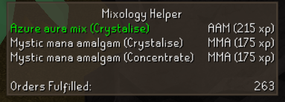
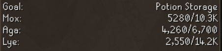

  <picture>
    <source media="(prefers-color-scheme: light)" srcset="./banner_black.png">
    
  </picture>

---
The **Mixology Helper** plugin assists players in efficiently completing the Mastering Mixology minigame, a Herblore activity located in Aldarin. This plugin optimizes the workflow by highlighting important game elements, displaying potion orders, and tracking progress.

# Features Overview
- **Interactive Element Highlights**
  - Highlights key objects like the **Levers, Mixer, Processing Machines**, and **Conveyor Belt**, helping players focus on the next required action to speed up potion creation.
  - Highlights the best potion order based on the player's current **Herblore level** and configured priorities. (e.g., maximizing experience or a certain ingredient)
- **Infoboxes for Tracking Progress**
  - Infobox showing **total potions made**, helping players track their overall progress.
  - Infobox for the **best potion order** to make, including details on the potion's ingredients and the experience it provides.
  - Supports **goal tracking** for specific rewards, showing resin progress in the format of either "remaining" or "current/total" based on player preference.
- **Order Fulfillment and Potion Tracking**
  - Displays the **current potion order list**, highlighting the best order and showing experience gained for each.
  - Automatically tracks **mature digweed spawn**, notifying players to collect it for extra experience and resin bonuses.
  - Tracks **number of potions completed**, helping players monitor their achievements and providing an infobox for quick reference.
- **Configurable Display Options**
  - **Toggle to show/hide** potion orders, completed orders, and other elements on the info panel.
  - Configurable **goal tracking** that allows players to set their resin goal for rewards, with options to hide completed resin amounts.
  - Customizable **infoboxes** for showing completed orders, best order to craft, and resin goal tracking.
  - **Notifications** for when mature digweed spawns, alerting players to collect it in time.

# Pictures
Levers Highlight              |  Mixer Highlight
:-------------------------:|:-------------------------:
|

Potion Order Display  |  Best Order Infobox
:-------------------------:|:-------------------------:
|

Resin Progress Tracking |  Mature Digweed Notification
:-------------------------:|:-------------------------:
|Adding once I catch one

# Plugin Features in Detail

### Highlighting Elements
The plugin automatically highlights key game elements like levers, the mixer, and the processing machines (retort, agitator, alembic) as the player progresses through the potion creation process. This makes it easy to know what to click next to ensure efficient potion creation.

- **Levers**: Shows which levers to pull based on the current recipe and potion being made.
- **Mixer**: Highlights the mixer when it's time to pick up a potion, and provides color-coded feedback if the wrong potion is selected.
- **Machines**: Highlights the appropriate processing machine based on the current potion's process step, such as concentrating, homogenizing, or crystallizing.

### Potion Order Tracking
The plugin displays a panel with the current available orders, showing the name of the potion, the process required, and experience gained for completing each one. It highlights the best potion to make based on the player's configured priority (either focusing on maximizing experience or ingredient efficiency).

### Goal Tracking and Infoboxes
The plugin allows players to track resin progress toward a specific goal item or reward. It shows how much resin of each type (mox, aga, lye) is needed, and offers a choice between displaying progress as "remaining" or "current/total."

Infoboxes are available for tracking:
- **Best order to make**: Displays the potion recipe and required ingredients for the best potion based on your priorities.
- **Total potions made**: Shows the cumulative number of potions completed.

### Notifications and Alerts
The plugin sends a notification whenever a **mature digweed** spawns in the facility, alerting players to collect it in time for bonus experience and resin. This ensures players don't miss out on valuable rewards.

# Installation
To install the **Mastering Mixology Helper** plugin, follow these steps:
1. Open the **Runelite** client.
2. Go to the **Plugin Hub**.
3. Search for **Mixology Helper**.
4. Click **Install** and enable the plugin.

# Contributors

- [BlueSoapTurtle(GIM S0AP)](https://github.com/BlueSoapTurtle) - Initial development, highlighting system, infoboxes, and resin tracking.
- Garbo Gang - Trolling, testing, and feedback.

